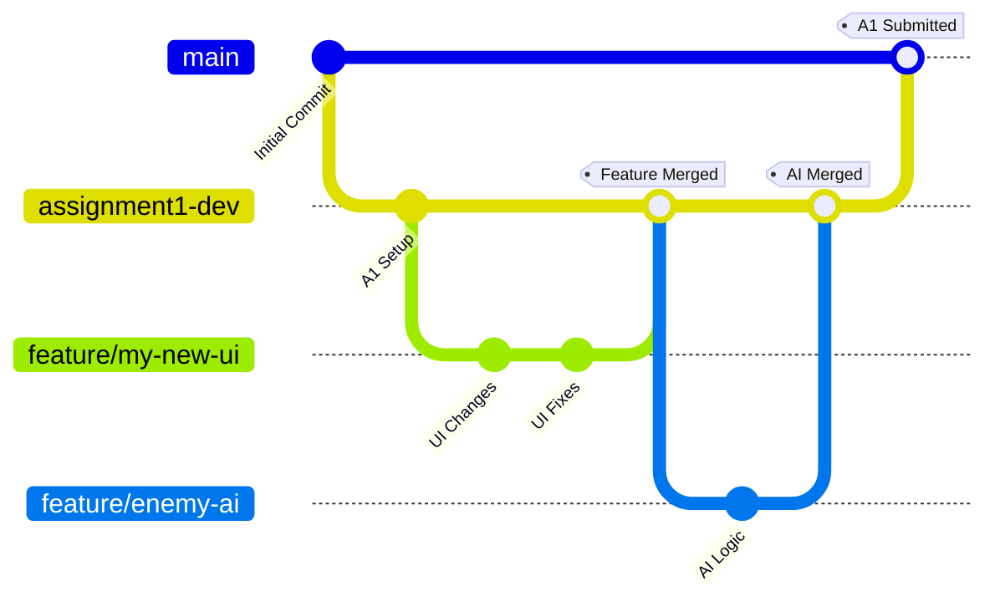

# Unity Projects Team Git Workflow

A beginner-friendly guide to collaborating on Unity projects using Git.

---

## 📁 What's in This Repository?

```
UnityProjectsUXDM/
├── Assignment 1/
│   ├── Assets/
│   ├── Packages/
│   └── ProjectSettings/
├── Assignment 2/
├── .gitignore
└── README.md
```

- **Each Assignment folder** = A separate Unity project
- **.gitignore** = Tells Git to ignore temporary Unity files
- **.meta files** = Unity's tracking files (important - don't delete!)

---

## 🌳 How We Organize Our Work (Branches)

Think of branches like separate workspaces:

| Branch Name | What It's For |
|-------------|---------------|
| `main` | Final, submitted versions only |
| `assignment1-dev` | Where we build Assignment 1 together |
| `feature/your-name` | Your personal workspace for experiments |

### Visual Workflow



**How it works:** You work on your own branch → Test it → Merge into `assignment1-dev` → When everything's done, merge into `main`

---

## 🚀 Getting Started (One-Time Setup)

### Option A: Using Command Line

1. **Clone (download) the repository**
   ```bash
   git clone https://github.com/lvkolb/UnityProjectsUXDM.git
   cd UnityProjectsUXDM
   ```

2. **Switch to the development branch**
   ```bash
   git checkout assignment1-dev
   ```

### Option B: Using GitHub Desktop

1. Open GitHub Desktop
2. Click **File → Clone repository**
3. Paste this URL: `https://github.com/lvkolb/UnityProjectsUXDM.git`
4. Choose where to save it on your computer
5. Use the branch dropdown at the top to switch to `assignment1-dev`

---

## 💼 Daily Workflow

### Using Command Line

**Step 1: Start your day by getting the latest changes**
```bash
git checkout assignment1-dev
git pull origin assignment1-dev
```

**Step 2: Create your own workspace (feature branch)**
```bash
git checkout -b feature/your-feature-name
```
*Example:* `feature/player-movement` or `feature/ui-menu`

**Step 3: Work in Unity**
- Open the Unity project
- Make your changes
- Save scenes, prefabs, and scripts
- Unity will auto-create temporary files (Git ignores these automatically)

**Step 4: Save your work to Git**
```bash
git add .
git commit -m "Added player jump mechanic"
```

**Step 5: Upload your branch to GitHub**
```bash
git push -u origin feature/your-feature-name
```

**Step 6: Request to merge your work**
- Go to GitHub in your browser
- Click "Create Pull Request"
- Wait for a teammate to review
- Once approved, merge into `assignment1-dev`

---

### Using GitHub Desktop

1. **Open GitHub Desktop** and make sure you're in the right repository
2. **Switch to `assignment1-dev`** using the branch dropdown
3. **Click "Fetch origin"** to download latest changes
4. **Create a new branch** (Branch → New Branch)
   - Name it something like `feature/my-ui-fix`
5. **Work in Unity** and save your changes
6. **Return to GitHub Desktop**
   - You'll see your changed files listed
   - Write a description of what you did
   - Click "Commit to feature/..."
7. **Click "Push origin"** to upload your changes
8. **Click "Create Pull Request"** to request merging your work

---

## ⚙️ Unity-Specific Important Notes

### ✅ Always Do This

- **Include .meta files** - Unity needs these to work properly
- **Enable text serialization** (makes teamwork easier):
  1. Open Unity
  2. Go to **Edit → Project Settings → Editor**
  3. Set **Asset Serialization** to **Force Text**
  4. Set **Version Control Mode** to **Visible Meta Files**

### ❌ Never Commit These Folders

Git should automatically ignore these (thanks to `.gitignore`):
- `Library/` - Unity's cache
- `Temp/` - Temporary files
- `Logs/` - Log files
- `Obj/` - Build objects
- `Build/` or `Builds/` - Compiled game builds

**Why?** These are huge and Unity regenerates them automatically.

---

## 🤝 Team Collaboration Tips

1. **Always pull before you start working** - Get your teammates' latest changes
2. **Commit often with clear messages** - "Fixed player jump" is better than "stuff"
3. **Use feature branches** - Keeps your experiments separate from the main work
4. **Ask for reviews** - Don't merge directly into `assignment1-dev` without asking
5. **Communicate** - Tell your team what you're working on to avoid conflicts

---

## 📝 Quick Reference: Git Commands

| What You Want to Do | Command |
|---------------------|---------|
| Download the project for the first time | `git clone <repo-url>` |
| Switch to a different branch | `git checkout <branch-name>` |
| Create a new branch | `git checkout -b feature/my-feature` |
| Get latest changes from GitHub | `git pull origin <branch-name>` |
| See what files you changed | `git status` |
| Prepare files to save | `git add .` |
| Save your changes with a note | `git commit -m "your message"` |
| Upload your branch to GitHub | `git push -u origin <branch-name>` |

---

## 🆘 Common Questions

**Q: What if I made changes in the wrong branch?**  
A: Don't panic! Ask a teammate or your instructor for help with `git stash`.

**Q: What if two people edited the same file?**  
A: Git will ask you to resolve the "merge conflict." Open the file, choose which changes to keep, then commit.

**Q: Can I delete my feature branch after merging?**  
A: Yes! Once it's merged into `assignment1-dev`, you can safely delete it.

**Q: GitHub Desktop vs Command Line?**  
A: Both do the same thing! Use whichever feels more comfortable.

---

## 🎯 Quick Start Checklist

- [ ] Clone the repository
- [ ] Switch to `assignment1-dev` branch
- [ ] Set up Unity text serialization
- [ ] Create your feature branch
- [ ] Make your changes
- [ ] Commit and push
- [ ] Create a pull request
- [ ] Celebrate! 🎉

---

**Remember:** Git saves your work history. Don't be afraid to experiment - you can always go back!
